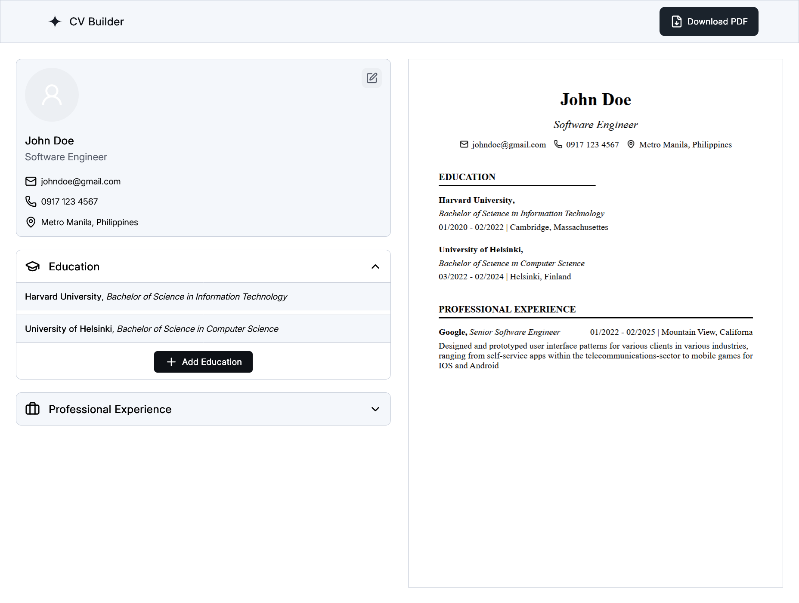

# CV Builder

A responsive CV builder app demonstrating controlled components, live state synchronization, and real-time PDF rendering using React

## Features

- Real-time document preview
- Downloadable PDF
- Responsive Design (mobile-first)

## Tools Used

- Frontend: React, CSS Modules
- PDF Generation: `@react-pdf/renderer`
- Document Preview: `react-pdf`

## What I Learned

- React state management for multi-section forms
- Dynamic styling with CSS Modules
- Using `@react-pdf/renderer` for PDF generation
- Real-time document preview using `react-pdf`

## Demo

### Desktop View

### Mobile View

